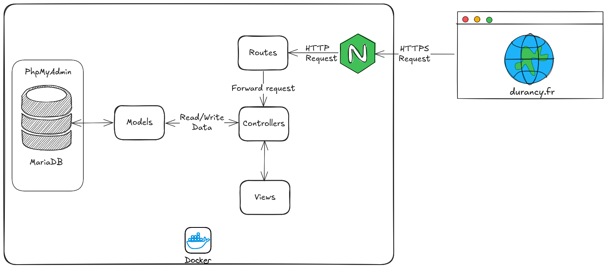

# Durancy API

Express.js REST API with MariaDB database, containerized with Docker and Nginx reverse proxy.

## Quick Start

```bash
git clone https://github.com/melissabelkessam/Durancy-back.git
cd Durancy-back
cp .env.sample .env
docker compose up --build
```
API will be available at https://localhost

## Env vars
Create a .env file with

```
NODE_ENV=production
DB_NAME=your_database
DB_USER=your_user
DB_PASSWORD=your_password
DB_HOST=db
JWT_SECRET=your_jwt_secret
```

## Services
- API: Node.js Express app on port 3000
- Database: MariaDB with persistent storage
- Reverse Proxy: Nginx with SSL (port 443)
- Database Admin: phpMyAdmin on http://localhost:8081

## Testing

### Unit Tests

```bash
# Run unit tests
docker compose --profile unit-test up unit-test

# Or locally
npm run test:unit
```

### Integration Tests

```bash
# Run integration tests (requires running database)
docker compose --profile integration-test up integration-test

# Or locally
npm run test:integration
```

### All Tests

```bash
npm test
```

## Development
```bash
# Local development (requires MariaDB running)
cd src
npm install
npm run dev

# Or with Docker
docker compose up
```

## API Documentation

Swagger documentation available at: https://api.durancy.fr/api-docs

## Tech Stack



- Backend: Node.js, Express.js
- Database: MariaDB
- ORM: Sequelize
- Authentication: JWT
- File Upload: Multer
- Email: Nodemailer
- Testing: Jest, Supertest
- Documentation: Swagger
- Container: Docker, Docker Compose
- Reverse Proxy: Nginx with SSL
- Security: bcrypt for password hashing

## Production Deployment

The application is configured for production with:

- SSL/TLS termination via Nginx
- Health checks for all services
- Persistent data volumes
- Automatic restart policies
- Security best practices
